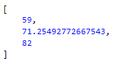
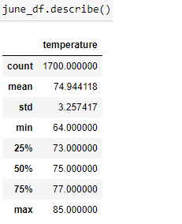
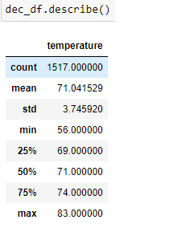

# surfs_up

## Project Overview
The purpose of this analysis is to help an investor  know if a business-decision in a surf shop on the Hawaiian island of Oahu is sound. Specifically, I am aiding in performing weather analysis based on historical weather data gathered over the course of many years on Oahu. This data spans the years 2010-2017. Throughout the course of our analysis, I am able to point at a few key measures of historical climate record-keeping, and my code allows us to make predictions about future weather patterns from here.

## Resources
- Data sources: hawaii.sqlite
- Software: Jupyter Notebook: 6.3.0, Visual Studio Code 1.60.2, SQLite3

## Results
- Given that December through April are Hawaii's busiest months in its tourism industry, let's focus on the temperatures during these months. Using my code and my flask local server, I am able to deduce that the average temperature between mid-December through mid-April is 71.25. This isn't blazing hot, but it's certainly nowhere near *chilly* enough outdoors to enjoy some ice cream in! Given that the months after April melt into spring, I believe that investing in this surf shop sounds worthwhile. Steady tourism in the start of the year, and then the blazing summer on the back half of the year sounds like the perfect window in which to sell ice cream.

- Temperatures tend to fluctuate similarly in winter and summer. From this, we can be rest assured that it is profitable to stay open on a round-the-year basis. Since the variance in temperature is 3.26 °F during the month of June and not much greater in the winter, at 3.75 °F in December, it can be assumed that this minor variance in temperature through the year will ensure a constant flow of potential customers, for both the surf and ice cream.

- As we can see, the maximum temperature throughout every June among the years 2010 and 2017 is 85 °F. Similarly, December's maximum temperature recorded among these seven years was 83 °F. Seeing as Oahu lies on the 21st parallel of earth's latitude, we know it stays plenty warm on this island year-round. As such, we can rely on predictable weather patterns on this propspective surf shop site.

## Summary
We can see that Oahu is the perfect spot to set up a surf and ice cream shop on. It is consistently warm on a yearly basis. As a site to set business on, it experiences reliable weather patterns. And it boasts ideal conditions for both surfing and ice cream consumption. Though our data is valuable and termperature and precipitation trends are incrdibly insightful, it would be great to have some data to query a few other measure on. First, I would like to be able to work with wind data. Where is wind blowing-in regularly? What wind pattern extremes exist? With answers to these questions, we could use our insight to lend knowledge to our surf instructors. Our instructors could have the resources to truly impress our customers with knowledge of winds and the ways that winds affect the surfing experience. Additionally, if we were able to query data on more data-collection sites beyond the eight we already have access to, we could discern even better opportunities in finding sites where to set shop up on, all across the Hawaiian islands.